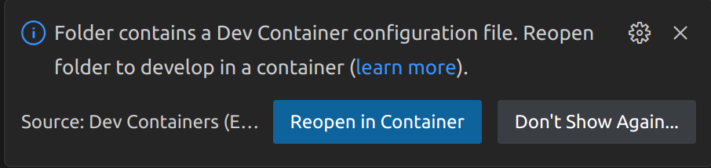
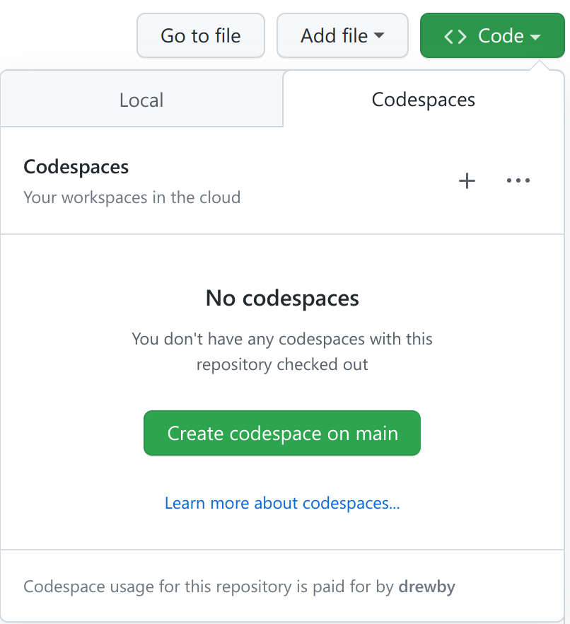
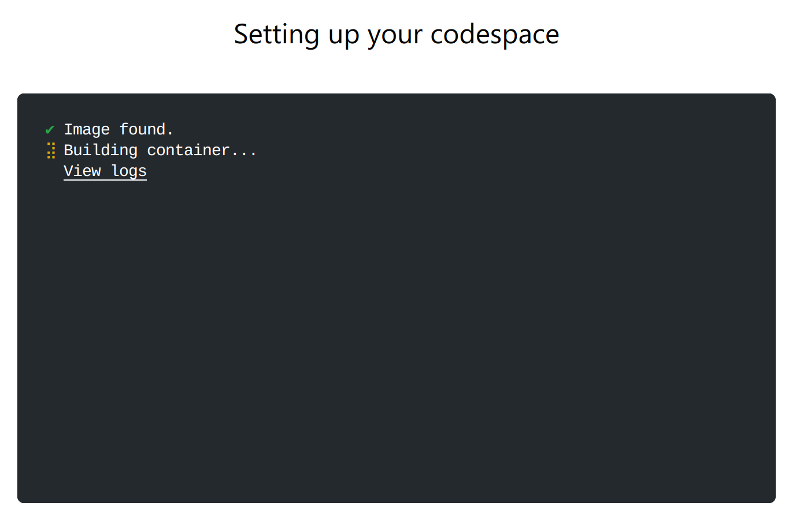
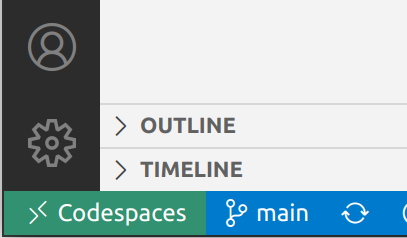

**Important Note:** This project is still a ***work in progress*** and is ***not ready*** for use or reference at this time. Please check back later for updates or check with the development team for the latest status.

# OpenTelemetry Playground

* [Getting Started](#getting-started)
* [Using the Tools](#using-the-tools)
* [How to Contribute](#how-to-contribute)
* [More Documentation](./docs/README.md)

The purpose of this project is to explore the OpenTelemetry Specification and SDKs. Currently the project has working code using the [Javascript](https://github.com/open-telemetry/opentelemetry-js) and [.NET](https://github.com/open-telemetry/opentelemetry-dotnet) OpenTelemetry libraries.  

The cluster includes two API applications, a frontend SPA web application (`todospa`) and a backend webapi (`todoapi`). The scenario is a classic Todo application where a user can add, delete, complete and list simple Todos. 

Incoming API requests (anything to /api) go through a Nginx ingress service on port 8080 which are forwarded to the ingress-nginx-dapr sidecar which then sends requests to the backend `todoapi` service.

Additionally, the cluster includes the following monitoring services:

* **Grafana**: a platform for analyzing and visualizing metrics and logs
* **Loki**: a log aggregation system
* **Prometheus**: a monitoring and alerting system
* **Jaeger**: a distributed tracing system

## Goals

The goals of this project are as follows:

* Explore OpenTelemetry DotNet implementation for Logs, Metrics, and Traces.
* Create extensions to enhance the API and/or SDK for .NET.
* Implement a sampling strategy using the OpenTelemetry Collector.


## Documentation

[Additional Documentation is Here](./docs/README.md)

## Getting Started

Here's how you can get started with this project. 

1. Follow one of the options below to create a Dev Container [on your local machine](#local-development) or as a [GitHub CodeSpace](#github-codespaces). 
2. It will take several minutes for container to launch and the [on-create.sh](.devcontainer/on-create.sh) script to run.
3. Open http://localhost:8080 in your browser.

**IMPORTANT**: The URL must use *http://localhost* so nginx recognizes the host. Using http://127.0.0.1 will not work.

### Local development

1. Clone the repository: 

```bash
git clone https://github.com/cse-labs/otel
```

2. Open the folder in Visual Studio Code.
3. Select the toast to *Reopen in Container*




4. If the toast didn't appear, open the command pallete (**Ctrl/Cmd + Shift + P**) and select *Dev Containers: Reopen in Container*
5. The first time you open the folder in a container, it may take a few minutes to create the container.

### Github Codespaces

1. Open the repository on Github.com (https://github.com/cse-labs/otel)
2. Above the code listing, click *Code*.
3. Click *Codespaces*.
4. Click  *Create codespace on main*.



5. It will take a few minutes to create the container. 




    *Eventually Visual Studio Code will launch inside your browser. However, you will want to connect from a local instance of Visual Studio Code to access the cluster via **localhost**.*

6. Click the word *Codespaces* in the bottom left corner of the screen and select *Open in VS Code Desktop* from the drop-down.



## Using the Tools

The following tools are included in the project for development and cluster management:

* **k9s**: A terminal-based UI to manage Kubernetes clusters.
* **kubectl**: A command-line tool for communicating with a Kubernetes cluster. 
* **curl**: A command-line tool for making HTTP requests. 
* **Grafana** (available at http://localhost:30000): Monitoring dashboards
* **Jaeger** (available at http://localhost:30001): Distributed traces
* **Static Website** (available at http://localhost:8080/): This is a web server pointed at the files in `src/todospa`

Grafana is connected to the datasources Prometheus, Loki, and Jaeger.

In addition to the above tools, the project also includes a `Makefile` for easier development. The `Makefile` contains the following commands:

* **make build-(ops|todoapi|todospa)**: Builds the ops, todoapi, or todospa component
* **make deploy-todaapi**: Deploys the todoapi component to the cluster
* **make all-todoapi**: Runs both *build* and *deploy*
* **make all**: Runs both *all-todoapi* and  *build-todospa* to build and deploy changes to both the frontend and backend components

## How to Contribute

The project is open to Microsoft FTE only at this time.

We welcome and appreciate contributions from the Microsoft community. There are several ways to contribute to this project, such as fixing bugs, improving documentation, adding new features, and more. If you are interested in contributing, please follow the guidelines below.

### Issues

If you encounter any bugs or issues, please submit an issue to the repository's issue tracker. Be sure to include a clear description of the issue, the expected behavior, and steps to reproduce the problem. 

### Code and Documentation Changes

Please submit a pull requests from your forked repository to the main repository. Include a link to an open issue that will be closed.
