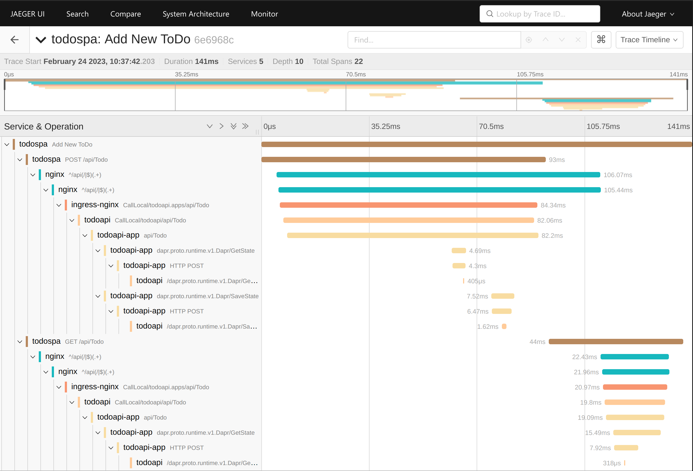

# Distributed Tracing

Distributed Tracing is used to track the flow of requests and messages across various applications, services and components. This example uses Jaeger and OpenTelemetry to collect, visualize and analyze the trace data. 

Jaeger is installed by helm chart with the following values:

```yaml
provisionDataStore:
  cassandra: false
allInOne:
  enabled: true
agent:
  enabled: false
collector:
  enabled: false
query:
  enabled: false
```

This is not a resilient installation of Jaeger and it will lose data on restarts, which is fine for the example. Because of the `allInOne` installation, the other jaeger services are disabled. The various collector endpoints for each service are still available via the `allInOne` image.

## Configuring trace clients

There are four places that we are required to configure endpoints for tracing:

1. The client HTML/JS application emits traces to a ZipKin endpoint.
2. The `ingress-nginx` service supports opentracing and is configured for a Jaeger endpoint.
3. The Dapr sidecars are configured to traces to an OTLP endpoint. 
4. The Web API uses the OpenTelmetry.net SDK and configured with an OTLP endpoint.

Because the client application initiates the Trace, we can visualize the full end-to-end trace for each action taken by the user.



## Client HTML/JS app

The client is instrumented using the OpenTelemetry javascript library to post traces from the web browser to an OTLP endpoint. The functionality is [described here](../src/todospa/README.md#tracingjs).

## Nginx Ingress

ingress-nginx supports an opentracing flag which will enable tracing for the service. There are multiple collector libaries supported, but the Jaeger library supports `w3c` headers for propogation. The configuration is in the values for the helm chart:

```yaml
controller:
  config: 
    enable-opentracing: "true"
    jaeger-collector-host: jaeger-agent.jaeger
    jaeger-propagation-format: w3c
```

## Dapr Sidecars

Dapr includes built-in support for tracing. It is enabled via the Dapr configuration used by the sidecar. Each namespace with Dapr sidecars will have the following config:

```yaml
tracing:
  samplingRate: "1"
  otel:
    endpointAddress: "jaeger-collector.jaeger:4318"
    isSecure: false
    protocol: http
```

## Web API

The ASP.NET Core Web API is using an "Ops SDK" which configures observability tools including tracing. This is described in the [Ops SDK Tracing Extension](../src/ops/docs/tracing.md) doc.

The tracing endpoint is configured in the `appsettings.json` file as:

```json
"Tracing": {
  "Enabled": true,
  "IncomingIgnore": "/metrics, /health",
  "OltpExportEndpoint": "http://jaeger-collector.jaeger:4318/v1/traces"
}
```

However, the endpoint setting could also be movied to environment variables using:

`Ops__Tracing__OltpExportEndpoint` and `Ops__Tracing__OltpExportProtocol`